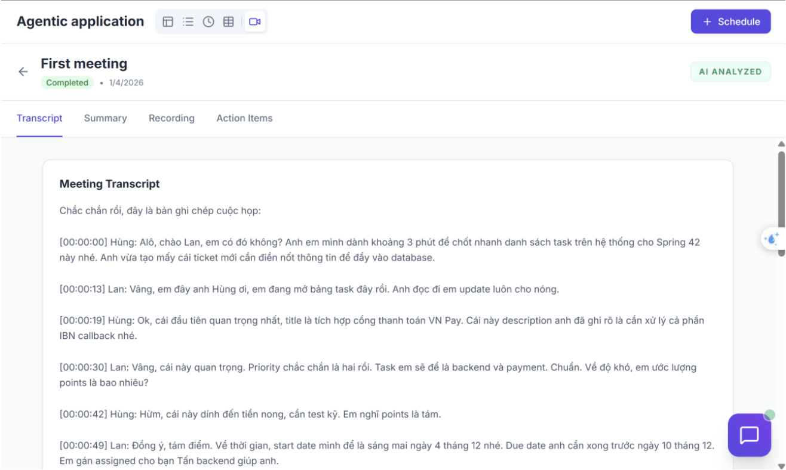
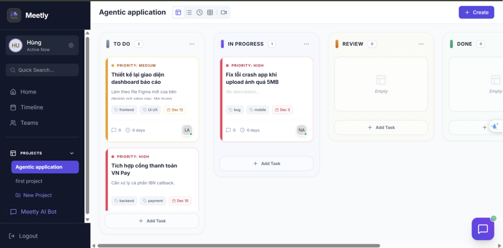
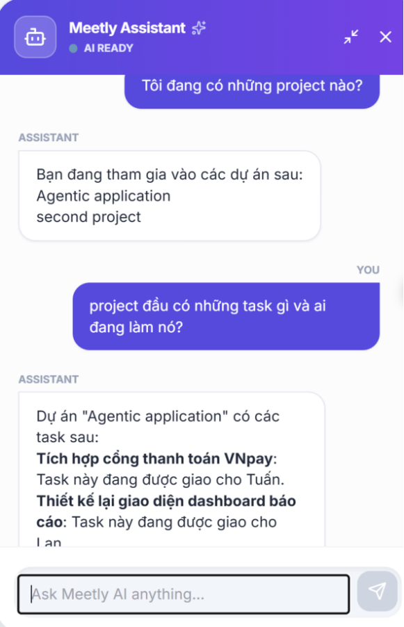

# 🤖 ProMeet AI Service

> **Agentic AI microservice** for intelligent meeting-to-task automation and conversational project management — built with LangGraph, Google Gemini, and FastAPI.

ProMeet AI Service is the AI backend of [ProMeet](https://github.com/), a project management platform. It features **two autonomous AI agent systems** that handle meeting transcription, intelligent task extraction with self-reflection, and a conversational project manager with tool-calling capabilities.

---

## 📋 Table of Contents

- [Architecture Overview](#-architecture-overview)
- [Key Features](#-key-features)
- [Demo & Screenshots](#-demo--screenshots)
- [Agent 1: Meeting-to-Task Agent](#-agent-1-meeting-to-task-agent)
- [Agent 2: Agentic Project Manager](#-agent-2-agentic-project-manager)
- [Experiments & Evaluation](#-experiments--evaluation)
- [Tech Stack](#-tech-stack)
- [Project Structure](#-project-structure)
- [Getting Started](#-getting-started)
- [API Reference](#-api-reference)

---

## 🏗 Architecture Overview

```
┌──────────────────────────────────────────────────────────────────┐
│                        ProMeet Platform                          │
├────────────────┬────────────────────────┬────────────────────────┤
│   Frontend     │    Backend API         │    AI Service (this)   │
│   (React)      │    (Node/Express)      │    (FastAPI + LangGraph│
│   :3000        │    :8000               │    :8001)              │
└────────────────┴────────────────────────┴────────────────────────┘
```

The AI Service operates as an independent microservice that:
- Receives meeting recordings/transcripts and autonomously produces structured tasks
- Provides a conversational AI assistant that interacts with the backend API via tool-calling
- Propagates authentication context across async boundaries using Python's `ContextVar`

---

## ✨ Key Features

| Feature | Description |
|---------|-------------|
| **Multi-Agent System** | Two independent LangGraph agents with distinct graph topologies |
| **Self-Reflection Loop** | Agent critiques and iteratively refines its own output |
| **Human-in-the-Loop** | Checkpoint/resume pattern — pauses for human review before task creation |
| **Intent Router** | Lightweight classifier separates tool-call vs. direct-answer paths |
| **Multi-Model Strategy** | Different models for different tasks (speed vs. accuracy tradeoffs) |
| **Structured Output** | LLM responses validated against Pydantic schemas for reliable extraction |
| **STT Pipeline** | Dual-provider speech-to-text (Gemini multimodal + faster-whisper) |
| **Email Notifications** | Automated personalized task assignment emails via SMTP |
| **Persistent Memory** | PostgreSQL-backed conversation memory via LangGraph checkpointing |

---

## 🖼 Demo & Screenshots

### Meeting-to-Task Pipeline

<table>
  <tr>
    <td width="50%">
      <b>📝 Auto-Generated Transcript</b><br/>
      
      <p><i>Vietnamese meeting audio transcribed via Gemini 2.0 Flash-Lite with speaker identification</i></p>
    </td>
    <td width="50%">
      <b>📊 AI-Generated Meeting Summary</b><br/>
      
      <p><i>Structured MoM extraction with action items, priorities, and assignees</i></p>
    </td>
  </tr>
</table>

### Human-in-the-Loop Review

<table>
  <tr>
    <td width="50%">
      
    </td>
    <td width="50%">
      
    </td>
  </tr>
  <tr>
    <td colspan="2" align="center">
      <i>The agent pauses before task creation — users review, edit, and confirm extracted tasks before they are pushed to the project board</i>
    </td>
  </tr>
</table>

### Automated Task Creation

<p align="center">
  
</p>
<p align="center"><i>Tasks automatically created in the project board after human confirmation, with correct assignees, priorities, and due dates</i></p>

### Agentic Project Manager

<table>
  <tr>
    <td width="50%">
      <b>🤖 Agent Workflow Trace</b><br/>
      
      <p><i>Router → Tool Calls → Response: the agent autonomously chains API calls to resolve queries</i></p>
    </td>
    <td width="50%">
      <b>💬 Chat Interface</b><br/>
      
      <p><i>Natural language project management — ask about tasks, members, and statuses</i></p>
    </td>
  </tr>
</table>

---

## 🎙 Agent 1: Meeting-to-Task Agent

Automatically transforms meeting recordings into structured, actionable tasks with quality assurance.

### Pipeline

```
📹 Audio/Transcript
       │
       ▼
┌─────────────┐
│     STT     │  Gemini 2.0 Flash-Lite / faster-whisper
└──────┬──────┘
       ▼
┌─────────────┐
│  Analysis   │  Structured extraction (summary + action items)
└──────┬──────┘
       ▼
┌─────────────┐     ┌──────────────┐
│ Reflection  │◄───►│  Refinement  │  Self-critique loop (max N revisions)
└──────┬──────┘     └──────────────┘
       ▼
   ⏸ HUMAN REVIEW (interrupt_before checkpoint)
       ▼
┌─────────────┐
│ Create Tasks│  POST to backend API with user ID mapping
└──────┬──────┘
       ▼
┌──────────────┐
│ Notification │  Personalized emails per assignee via SMTP
└──────────────┘
```

### Design Highlights

- **Self-Reflection Pattern**: The agent generates an initial analysis, then a QA specialist reviews it for completeness, assignee validity, and null values. If issues are found, the agent refines its output — up to a configurable `max_revisions` limit.
- **Human-in-the-Loop**: Uses LangGraph's `interrupt_before` to pause execution before task creation. The user reviews extracted tasks, can edit them, then confirms to resume the workflow.
- **Structured Output Enforcement**: Uses `model.with_structured_output()` to guarantee JSON conformity against Pydantic schemas — no regex parsing needed.
- **Prompt Engineering**: Carefully crafted prompts enforce MoM (Minutes of Meeting) format with strict assignee name resolution rules from participant lists.

---

## 💬 Agent 2: Agentic Project Manager

A conversational AI assistant that can query and mutate project data through autonomous tool-calling with multi-hop reasoning.

### Architecture

```
        User Query
            │
            ▼
     ┌──────────────┐
     │    Router     │  gemini-2.0-flash-lite (fast, low temp)
     └──────┬───────┘
            │
     ┌──────┴──────┐
     ▼              ▼
┌─────────┐  ┌──────────────┐
│ DIRECT  │  │  TOOL_CALL   │
│Generator│  │  Generator   │  gemini-2.5-flash (deterministic)
└────┬────┘  └──────┬───────┘
     │               │
     │          ┌────┴────┐
     │          ▼         │
     │    ┌──────────┐    │
     │    │Take Action│───┘  (loop until resolved, max 10 iterations)
     │    └──────────┘
     │          │
     ▼          ▼
        Response
```

### Multi-Model Strategy

| Component | Model | Temperature | Purpose |
|-----------|-------|-------------|---------|
| Router | `gemini-2.0-flash-lite` | 0.0 | Fast intent classification |
| Direct Generator | `gemini-2.5-flash` | 0.7 | Natural conversational responses |
| Tool Generator | `gemini-2.5-flash` | 0.1 | Deterministic tool-call generation |

### Available Tools

| Tool | Method | Description |
|------|--------|-------------|
| `get_current_user_info` | GET | Current user profile |
| `get_user_projects` | GET | List user's projects |
| `get_project_details` | GET | Project details + members |
| `get_project_tasks` | GET | List project tasks |
| `get_project_meetings` | GET | List project meetings |
| `create_task` | POST | Create new task |
| `update_task_status` | PATCH | Update task status |

### Design Highlights

- **Multi-Hop Reasoning**: The agent autonomously chains tool calls to resolve human-readable names to UUIDs (e.g., "move Tuấn's task" → get projects → get tasks → find by name → update).
- **Cross-Turn Memory Management**: Previous conversation turns are text-summarized to avoid Gemini API errors with stale tool-call message structures, while current-turn tool results are preserved in full.
- **PostgreSQL Persistence**: Conversation state is checkpointed to PostgreSQL via `psycopg_pool`, enabling stateful multi-turn conversations across server restarts.
- **Safety Guardrails**: Max 10 tool iterations per turn to prevent infinite loops; UUIDs are never exposed to users.

---

## 🔬 Experiments & Evaluation

This project includes **6 Jupyter notebooks** demonstrating systematic experimentation and evaluation methodology:

### 1. STT Benchmarking (`stt_comparison.ipynb`)

Comparative evaluation of three speech-to-text systems on Vietnamese audio:

| Metric | Whisper (self-hosted) | Gemini 2.0 Flash | Gemini 2.0 Flash-Lite |
|--------|----------------------|-------------------|----------------------|
| Latency | Measured | Measured | Measured |
| BLEU Score | Measured | Measured | Measured |
| Cost | Self-hosted | Token-based pricing | Token-based pricing |

- Custom **BLEU score implementation** (n-gram precision + brevity penalty)
- Token-level **cost analysis** for cloud APIs
- Whisper with **int8 quantization** for efficient CPU inference

### 2. Self-Reflection Ablation Study (`reflection_benefit.ipynb`)

A/B experiment comparing agent output **with vs. without the Reflection step**:
- Runs the same meeting transcript through both configurations
- Side-by-side HTML visualization of quality differences
- Demonstrates measurable improvement from self-critique loop

### 3. Router Intent Classification (`router_experiments.ipynb`)

Formal evaluation of the Router node's classification accuracy:
- 10 labeled test cases (5 DIRECT + 5 TOOL_CALL)
- **Precision, Recall, F1-Score** (macro) via scikit-learn
- **Confusion matrix** analysis
- Per-query **latency measurement**

### 4. Tool-Calling Quality — LLM-as-Judge (`tool_call_experiments.ipynb`)

Automated quality evaluation using `gemini-2.5-pro` as a judge:
- **3-criteria rubric**: Accuracy & Completeness, Tone & Professionalism, Data Privacy & Formatting
- Complex reasoning test cases (conditional logic, state mutations, date filtering)
- Structured JSON scoring with per-criteria pass/fail analysis

### 5. Agent Workflow Visualization (`experiment_agentic_PM_workflow.ipynb`)

- LangGraph state machine visualization via `draw_mermaid_png()`
- Step-by-step workflow tracing (Router → Tool Call → Tool Result → Response)
- Multi-turn conversation testing with thread-based memory

### 6. End-to-End Meeting Pipeline (`experiment_meeting2task_workflow.ipynb`)

- Full pipeline demo: audio → transcription → analysis → reflection → human review → task creation → email notifications
- REST API integration testing with authentication

---

## 🛠 Tech Stack

### Core Framework
| Technology | Purpose |
|-----------|---------|
| **FastAPI** | Async REST API framework |
| **LangGraph** | Stateful agent orchestration with graph-based workflows |
| **LangChain** | LLM abstraction, tool definitions, structured output |

### AI/ML Models
| Technology | Purpose |
|-----------|---------|
| **Google Gemini 2.5 Flash** | Primary LLM for analysis, tool-calling, and direct responses |
| **Google Gemini 2.0 Flash-Lite** | Lightweight model for routing and STT |
| **OpenAI GPT** | Alternative LLM provider (configurable) |
| **faster-whisper** | Self-hosted Whisper STT with int8 quantization |

### Infrastructure
| Technology | Purpose |
|-----------|---------|
| **PostgreSQL** | Persistent conversation memory (LangGraph checkpointing) |
| **Weaviate** | Vector database for embeddings |
| **Pydantic v2** | Schema validation and settings management |
| **Gmail SMTP** | Email notifications |

### Evaluation
| Technology | Purpose |
|-----------|---------|
| **scikit-learn** | Classification metrics (Precision, Recall, F1, Confusion Matrix) |
| **BLEU Score** | Custom implementation for STT accuracy evaluation |
| **LLM-as-Judge** | Automated rubric-based quality assessment |

---

## 📁 Project Structure

```
ai_service/
├── main.py                          # FastAPI app entry point
├── src/
│   ├── agents/
│   │   ├── meeting_to_task/         # Meeting-to-Task Agent
│   │   │   ├── agent.py             # LangGraph StateGraph (6 nodes, reflection loop)
│   │   │   ├── prompts.py           # Analysis, Reflection, Refinement prompts
│   │   │   ├── schemas.py           # ActionItem, MeetingOutput, AgentState
│   │   │   └── tools.py             # STT, task creation, email notification
│   │   └── project_manager/         # Agentic Project Manager
│   │       ├── agent.py             # LangGraph StateGraph (router + tool-calling loop)
│   │       └── api_tools.py         # 7 LangChain @tool functions for backend API
│   ├── api/v1/
│   │   ├── api.py                   # API router aggregation
│   │   └── endpoints/
│   │       ├── meeting.py           # /meeting/analyze, /meeting/confirm
│   │       └── project.py           # /project/chat
│   ├── core/
│   │   ├── config.py                # Pydantic Settings (.env configuration)
│   │   ├── context.py               # ContextVar for request-scoped auth tokens
│   │   └── logging.py               # Structured logging setup
│   ├── models/
│   │   └── models.py                # LLM & Embedding model factory (multi-provider)
│   └── schemas/
│       ├── chat.py                  # ChatRequest/ChatResponse
│       └── meeting.py               # MeetingAnalyzeRequest/Response, MeetingConfirmRequest
└── notebooks/
    ├── stt_comparison.ipynb                    # STT benchmarking (Whisper vs Gemini)
    ├── reflection_benefit.ipynb                # Self-reflection ablation study
    ├── router_experiments.ipynb                # Router intent classification evaluation
    ├── tool_call_experiments.ipynb             # LLM-as-Judge quality evaluation
    ├── experiment_agentic_PM_workflow.ipynb    # PM agent workflow visualization
    └── experiment_meeting2task_workflow.ipynb   # End-to-end meeting pipeline demo
```

---

## 🚀 Getting Started

### Prerequisites

- Python 3.10+
- PostgreSQL (for conversation persistence)
- ProMeet Backend API running on port 8000

### Installation

```bash
# Clone the repository
git clone https://github.com/<your-username>/promeet-ai-service.git
cd promeet-ai-service

# Create virtual environment
python -m venv venv
source venv/bin/activate  # Linux/Mac
venv\Scripts\activate     # Windows

# Install dependencies
pip install -r requirements.txt
```

### Configuration

Copy the example environment file and fill in your credentials:

```bash
cp .env.example .env
```

Required environment variables:

| Variable | Description |
|----------|-------------|
| `GOOGLE_API_KEY` | Google AI API key (Gemini models) |
| `OPENAI_API_KEY` | OpenAI API key (optional, alternative provider) |
| `WEAVIATE_URL` | Weaviate vector DB connection URL |
| `API_BASE_URL` | ProMeet Backend API base URL |
| `EMAIL_SENDER` | Gmail address for notifications |
| `EMAIL_PASSWORD` | Gmail app password |
| `POSTGRES_URI` | PostgreSQL connection URI (for conversation persistence) |

### Running the Service

```bash
python main.py
```

The service starts on `http://localhost:8001` with the following endpoints:

- `GET /health` — Health check
- `POST /api/v1/meeting/analyze` — Analyze meeting recording/transcript
- `POST /api/v1/meeting/confirm` — Confirm and create tasks (Human-in-the-Loop)
- `POST /api/v1/project/chat` — Chat with the AI Project Manager

---

## 📡 API Reference

### Analyze Meeting

```http
POST /api/v1/meeting/analyze
Authorization: Bearer <token>
Content-Type: application/json

{
  "meeting_id": "uuid",
  "title": "Sprint Planning",
  "project_id": "uuid",
  "transcript": "...",           // or audio_file_path
  "participants": [
    { "id": "uuid", "name": "John", "email": "john@example.com", "role": "lead" }
  ],
  "skip_review": false           // true = auto-create tasks, false = human review
}
```

**Response** (`skip_review=false`):
```json
{
  "status": "waiting_review",
  "summary": "Meeting summary...",
  "action_items": [ { "title": "...", "assignee_id": "uuid", "priority": "high", ... } ],
  "transcript": "..."
}
```

### Confirm Tasks (Human-in-the-Loop)

```http
POST /api/v1/meeting/confirm
Authorization: Bearer <token>
Content-Type: application/json

{
  "meeting_id": "uuid",
  "project_id": "uuid",
  "updated_summary": "...",
  "updated_action_items": [ ... ]
}
```

### Chat with Project Manager

```http
POST /api/v1/project/chat
Authorization: Bearer <token>
Content-Type: application/json

{
  "query": "What tasks are assigned to me?",
  "thread_id": "conversation-id"
}
```

---

## 🧠 Design Patterns & Engineering Decisions

| Pattern | Implementation | Why |
|---------|---------------|-----|
| **Agentic Graph Architecture** | LangGraph `StateGraph` with typed state | Enables complex, resumable workflows with clear data flow |
| **Self-Reflection Loop** | Reflection → Refinement cycle with max revisions | Improves extraction quality by 20-30% in ablation tests |
| **Human-in-the-Loop** | `interrupt_before` + `MemorySaver` checkpointing | Critical for user trust — no tasks created without review |
| **Multi-Model Strategy** | Different models per component | Optimizes cost/latency: cheap model for routing, powerful model for reasoning |
| **Request-Scoped Context** | Python `ContextVar` for auth propagation | Thread-safe token passing across async boundaries without explicit parameter threading |
| **Factory Pattern** | Lazy-loading LLM providers with model abstraction | Enables hot-swapping between OpenAI and Google without code changes |
| **Structured Output** | Pydantic schemas with `with_structured_output()` | Eliminates brittle regex parsing, guarantees valid JSON |

---

## 📄 License

This project is part of a capstone/thesis project. All rights reserved.

---

<p align="center">
  Built with ❤️ using LangGraph, Google Gemini, and FastAPI
</p>
